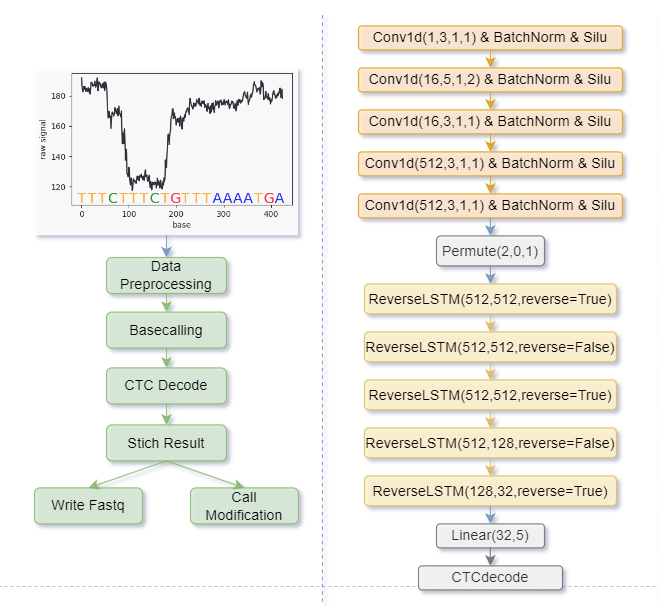

# Sturgeon_CPP 高性能纳米孔测序Basecalling系统

# 

### 概述
Sturgeon_CPP 是一个基于 C++ 语言开发的高性能Basecalling工具，专注于将纳米孔 HDF5 测序数据文件转换为 FASTQ 格式的序列数据（Basecalling），助力生物信息学研究。该项目充分利用 C++ 的高效性能，结合多 GPU 并行推理和半精度推理技术，显著提升数据处理速度和效率。下图为软件架构（左）以及模型架构（右）。



### 核心亮点

- 高效数据加载：借助线程池，多进程以及共享内存等技术，即使hdf5官方api对单机并行读取有限制，Sturgeon_CPP依旧可以高效的加载h5数据。
- 基于libtorch（Pytorch C++ api）: Sturgeon_CPP 基于libtorch，高效的进行数据的预处理，并且可以方便的加载由pytorch训练好的模型。
- 高效模型推理：Sturgeon_CPP可以高效的进行模型推理，支持半精度和全精度运行，以及多GPU推理。
- CTC解码器：自主实现CTC解码器，以配合碱基解码的需求。
- 并行优化：Sturgeon_CPP是一个深度优化的并行程序，可以保持长时间高效稳定的运行，相较于python实现，速度提高了100%。


### 使用方法
1. **克隆仓库**
```bash
git clone https://github.com/huicongyao/Sturgeon_CPP.git
cd Sturgeon_CPP
```
2. **构建项目**

在构建项目之前，确保你的设备已安装版本相互对应的libtorch和cuda（如果路径不一样，需要在CMakeLists.txt中修改相应的路径）。除此之外，还要安装以下的第三方库：

* [spdlog](https://github.com/gabime/spdlog)： 一个高性能的C++日志库
* boost：一个广泛使用、高质量且开源的 C++ 库集合，本项目使用其中的多进程和共享内存模块
* libhdf5：hdf5 C++ api，该api限制多线程并行访问。

```bash
mkdir build
cd build
cmake ..
make
```
3. **运行程序**
```bash
./Sturgeon [options]
```
   其中 [options] 为命令行参数，具体参数说明如下：
   `-h, --help`：显示帮助信息并退出。

   `-v, --version`：输出版本信息并退出。

   `--output_dir`：输出目录，Sturgeon 会在该目录下输出 pass.fastq 和 fail.fastq 文件，以平均质量值 10 为阈值进行区分。默认值为 "../"。

   `--num_sub_proc`：加载 H5 文件的子进程数量，默认设置为 12。

   `--batch_size`：批次大小，默认值为 1024。

   `--chunk_size`：数据块大小，默认值为 6000。

   `--overlap`：重叠大小，默认值为 500。

   `--stride`：步长大小，默认值为 5。

   `-output_moves`：是否输出序列在原始信号中对应的位置信息，默认不输出。

   `-half`：是否使用半精度推理，默认开启。

4. **示例**
   以下是一个简单的示例，展示如何使用 Sturgeon_CPP 进行数据处理：
```   bash
./Sturgeon --output_dir ./output --num_sub_proc 16 --batch_size 2048 --chunk_size 6000 --overlap 500 --stride 5 -output_moves -half
```
